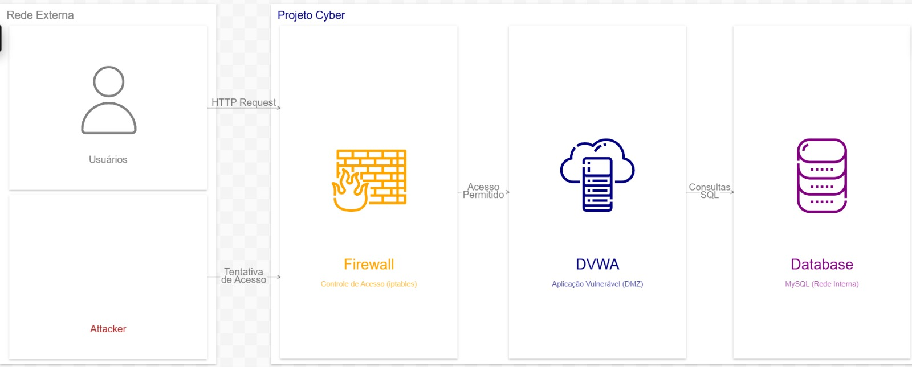

# 🔐 Projeto Cyber

#### Instituto Federal de Mato Grosso — Campus Cuiabá Octáyde
#### Disciplina: Programação para Rede e Gerência e Segurança de Redes 

## 📌 Visão Geral

Este projeto implementa um laboratório de Redes e Segurança da Informação utilizando containers e Infraestrutura de Código (IaC).

O ambiente simula um cenário real com:

* Aplicação vulnerável (DVWA)

* Banco de dados isolado
* Máquina atacante
* Segmentação de rede (External / DMZ / Internal)
* Controle de acesso (Firewall conceitual)

---

## 🏗️ Arquitetura

O ambiente é dividido em três zonas:

| Zona | Descrição |
|---|---|
| Rede Externa | Simula internet e hosts externos |
| DMZ | Contém a aplicação DVWA |
| Rede Interna | Contém o banco de dados MySQL |

<br>

### 🔒 Regras de Segurança

|Origem   || Serviço  ||  Resultado|
| ------- |---| -------- |---| ------    |
|Users    |→ | DVWA     |→| Acesso permitido ✅|
|Attacker |→ | DVWA     |→| Acesso bloqueado 🚫|
|Attacker |→ | Database |→| Acesso bloqueado 🚫|
|DVWA     |→ | Database |→| Acesso permitido ✅|

---

## 🛠️ Tecnologias Utilizadas

| Tecnologia     | Função               |
| -------------- | -------------------- |
| Podman         | Containers           |
| Podman Compose | Orquestração         |
| Ubuntu         | Base dos containers  |
| DVWA           | Aplicação vulnerável |
| MySQL          | Banco de dados       |
| FW (iptables)  | Proteger a aplicação |

---

## 📂 Estrutura do Projeto

```
projetocyber/
│
├── arquitetura.jpeg
├── podman-compose.yml
└── setup.sh

```

---

## ⚙️ Pré-requisitos

* Ubuntu 20.04+ ou WSL(Windows)

* CPU: 2 cores (mínimo)
* RAM: 4 GB (mínimo)
* Disco: 10 GB livres
* Podman
* Python3 + pipx

### ☕ Hardware de Homologação

| SO     |   CPU    | RAM   | Disco|
|--------| -------- | ------| ---- |
| POP-OS (Ubuntu) | i5-8256U | 16 GB | 1TB  |
| WIN 11 |          |16 GB  | 1TB  |

---

## 🚀 Como Executar
### Passo 1

**No Windows**, no iniciar, pesquise WSL e execute-o.
Caso não o encontre, faça o download em:

```
https://ubuntu.com/download/wsl/thank-you?version=26.04&architecture=amd64
```
**No Linux**, abra o terminal.

### Passo 2
```bash
git clone https://github.com/Petrus123456/projetocyber
cd projetocyber
chmod +x setup.sh
./setup.sh
```

---

## 🌐 Acesso

```
http://localhost:8080
```

Login:

* user: admin
* senha: password

---

## 🧪 Testes

### Acesso pelo atacante (deve falhar)

```bash
curl http://dvwa
```

---

### Acesso pelo navegador (deve funcionar)

Abrir:

```
http://localhost:8080
```

---

### Acesso ao banco (deve falhar)

```bash
mysql -h db -u dvwa -p
```

---

## ⚠️ Vulnerabilidade Inicial

Na arquitetura inicial, o atacante conseguirá acessar diretamente o banco.

Após a segmentação:

* acesso foi bloqueado
* rede isolada corretamente

---

## 🔒 Melhorias Implementadas

* Segmentação de rede
* Isolamento do atacante
* Separação em zonas (DMZ)
* Controle de acesso via firewall (conceitual)
* Base para firewall real (iptables)

---

## 🧠 Conceitos Aplicados

* Infrastructure as Code (IaC)
* Network Segmentation
* Defense in Depth
* Principle of Least Privilege

---

## 🧹 Parar o Ambiente

```bash
podman-compose down
```

---

## 📌 Observações


---

## 👨‍💻 Autores do Projeto

<table>
    <td align="center">
      <a href="#" title="defina o título do link">
        <br>
        <sub>
          <b>Eduardo Prado</b>
        </sub>
      </a>
    </td>
    <td align="center">
      <a href="https://github.com/Petrus123456" title="Perfil Pedro">
        <br>
        <sub>
          <b>Pedro Brito</b>
        </sub>
      </a>
    </td>
  </tr>
</table>
