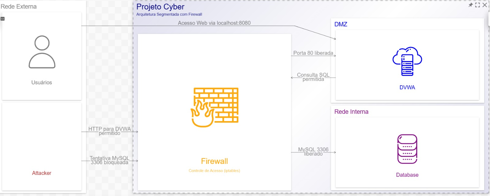

# 🔐 Projeto Cyber

#### Instituto Federal de Mato Grosso — Campus Cuiabá Octáyde

#### Disciplina: Programação para Rede e Gerência e Segurança de Redes

---

## 📌 Visão Geral

Este projeto implementa um laboratório de **Redes e Segurança da Informação** utilizando containers e conceitos de **Infraestrutura como Código (IaC)**.

O ambiente simula um cenário real de rede segmentada, contendo:

* Aplicação vulnerável (DVWA)
* Banco de dados isolado
* Máquina atacante
* Segmentação de rede em zonas
* Firewall com regras reais usando `iptables`
* Scripts de automação e validação

O objetivo principal é demonstrar, de forma prática, como uma aplicação pode ser isolada em uma **DMZ**, enquanto o banco de dados permanece protegido em uma **rede interna**, permitindo somente os acessos necessários.

---

## 🏗️ Arquitetura

O ambiente é dividido em três zonas principais:

| Zona         | Descrição                                               |
| ------------ | ------------------------------------------------------- |
| Rede Externa | Simula a internet, usuários externos e máquina atacante |
| DMZ          | Contém a aplicação vulnerável DVWA                      |
| Rede Interna | Contém o banco de dados MySQL                           |

<br>

---

## 🌐 Topologia de Rede

| Rede         | Sub-rede        | Componentes         |
| ------------ | --------------- | ------------------- |
| External Net | `10.10.10.0/24` | Attacker + Firewall |
| DMZ Net      | `10.10.20.0/24` | DVWA + Firewall     |
| Internal Net | `10.10.30.0/24` | Database + Firewall |

### Endereçamento dos Containers

| Container  | Função               | IP                                             |
| ---------- | -------------------- | ---------------------------------------------- |
| `attacker` | Máquina atacante     | `10.10.10.10`                                  |
| `firewall` | Controle de tráfego  | `10.10.10.254`, `10.10.20.254`, `10.10.30.254` |
| `dvwa`     | Aplicação vulnerável | `10.10.20.10`                                  |
| `db`       | Banco de dados MySQL | `10.10.30.10`                                  |

---

## 🔒 Regras de Segurança

| Origem   | Destino  | Serviço        | Resultado           |
| -------- | -------- | -------------- | ------------------- |
| Users    | DVWA     | HTTP `8080/80` | Acesso permitido ✅  |
| Attacker | DVWA     | HTTP `80`      | Acesso permitido ✅  |
| Attacker | Database | MySQL `3306`   | Acesso bloqueado 🚫 |
| DVWA     | Database | MySQL `3306`   | Acesso permitido ✅  |

O firewall foi configurado para permitir o acesso externo apenas à aplicação DVWA, enquanto bloqueia o acesso direto ao banco de dados.

---

## 🛠️ Tecnologias Utilizadas

| Tecnologia     | Função                                    |
| -------------- | ----------------------------------------- |
| Podman         | Criação e gerenciamento dos containers    |
| Podman Compose | Orquestração dos serviços                 |
| Ubuntu         | Base dos containers Firewall e Attacker   |
| DVWA           | Aplicação vulnerável usada no laboratório |
| MySQL          | Banco de dados da aplicação               |
| iptables       | Criação das regras de firewall            |
| Shell Script   | Automação da infraestrutura               |
| WSL/Linux      | Ambiente de execução                      |

---

## 📂 Estrutura do Projeto

```bash
projetocyber/
│
├── podman-compose.yml   # Define containers, redes e IPs estáticos
├── setup.sh             # Sobe o ambiente e configura tudo automaticamente
├── firewall.sh          # Aplica rotas, NAT e regras iptables
├── test.sh              # Executa os testes automatizados do laboratório
├── arquitetura.jpeg     # Diagrama da arquitetura
└── README.md            # Documentação do projeto
```

---

## ⚙️ Pré-requisitos

* Ubuntu 20.04+ ou WSL no Windows
* CPU: 2 cores ou superior
* RAM: 4 GB ou superior
* Disco: 10 GB livres
* Podman
* Podman Compose
* Python3 + pipx

---

## ☕ Hardware de Homologação

| Sistema Operacional | CPU       | RAM   | Disco |
| ------------------- | --------- | ----- | ----- |
| Pop!_OS / Ubuntu    | i5-8256U  | 16 GB | 1 TB  |
| Windows 11 + WSL    | i7-11390H | 16 GB | 1 TB  |

---

## 🚀 Como Executar

### Passo 1 — Abrir o ambiente

**No Windows**, pesquise por WSL no menu iniciar e execute o Ubuntu.

Caso não tenha o WSL instalado, faça o download em:

```text
https://ubuntu.com/download/wsl
```

**No Linux**, basta abrir o terminal.

---

### Passo 2 — Clonar o repositório

```bash
git clone https://github.com/Petrus123456/projetocyber
cd projetocyber
```

---

### Passo 3 — Executar o setup automático

```bash
chmod +x setup.sh
./setup.sh
```

O script `setup.sh` realiza automaticamente:

* Limpeza de ambientes antigos
* Criação das redes
* Inicialização dos containers
* Conexão do firewall nas redes
* Instalação das dependências
* Aplicação das regras de firewall
* Execução dos testes automatizados

---

## 🌐 Acesso à Aplicação

Após executar o ambiente, acesse:

```text
http://localhost:8080
```

Credenciais padrão do DVWA:

| Usuário | Senha      |
| ------- | ---------- |
| `admin` | `password` |

---

## 🧪 Testes Automatizados

Para validar o ambiente manualmente, execute:

```bash
./test.sh
```

O teste verifica:

* Se os containers estão ativos
* Se o IP Forward está habilitado no firewall
* Se o atacante consegue acessar a DVWA na porta 80
* Se o atacante é bloqueado ao tentar acessar o banco
* Se a DVWA consegue acessar o banco MySQL
* Se as regras do `iptables` estão funcionando

Resultado esperado:

```text
TODOS OS TESTES PASSARAM COM SUCESSO
```

---

## 🔍 Testes Manuais

### Verificar containers ativos

```bash
podman ps
```

---

### Verificar acesso pelo navegador

Abrir:

```text
http://localhost:8080
```

---

### Testar acesso do atacante à DVWA

```bash
podman exec attacker nc -zvw 3 10.10.20.10 80
```

Resultado esperado:

```text
Connection to 10.10.20.10 80 port succeeded
```

---

### Testar bloqueio do atacante ao banco

```bash
podman exec attacker nc -zvw 3 10.10.30.10 3306
```

Resultado esperado:

```text
timed out
```

---

### Testar acesso da DVWA ao banco

```bash
podman exec dvwa bash -c "timeout 3 bash -c '</dev/tcp/10.10.30.10/3306' && echo 'DVWA acessa DB: OK' || echo 'DVWA acessa DB: FALHOU'"
```

Resultado esperado:

```text
DVWA acessa DB: OK
```

---

### Verificar regras do firewall

```bash
podman exec firewall iptables -L FORWARD -v -n --line-numbers
```

Exemplo esperado:

```text
Chain FORWARD (policy DROP)
num  pkts bytes target  prot  source          destination
1    ACCEPT     tcp     10.10.10.0/24   10.10.20.0/24   tcp dpt:80
2    ACCEPT     tcp     10.10.20.0/24   10.10.10.0/24   tcp spt:80
3    DROP       tcp     10.10.10.0/24   10.10.30.0/24   tcp dpt:3306
4    ACCEPT     tcp     10.10.20.0/24   10.10.30.0/24   tcp dpt:3306
5    ACCEPT     tcp     10.10.30.0/24   10.10.20.0/24   tcp spt:3306
```

---

## 🔥 Funcionamento do Firewall

O container `firewall` atua como ponto de controle entre as redes:

```text
External Net -> Firewall -> DMZ -> Firewall -> Internal Net
```

As regras aplicadas seguem a lógica:

* Permitir acesso HTTP da rede externa para a DVWA
* Bloquear acesso direto da rede externa ao banco de dados
* Permitir acesso da DVWA ao banco MySQL
* Bloquear qualquer outro tráfego não autorizado por padrão

A política padrão da chain `FORWARD` é:

```bash
DROP
```

Isso significa que todo tráfego encaminhado entre redes é bloqueado, exceto o que for explicitamente permitido.

---

## 🧹 Parar o Ambiente

Para desligar os containers:

```bash
podman-compose down
```

Para limpar containers e redes antigas:

```bash
podman rm -f firewall dvwa db attacker
podman network prune -f
```

---

## 🔒 Melhorias Implementadas

* Segmentação de rede
* Separação em zonas External, DMZ e Internal
* Isolamento do banco de dados
* Firewall real com `iptables`
* Rotas configuradas entre containers
* NAT com `MASQUERADE`
* Testes automatizados
* Script de setup completo
* Validação automática das regras de segurança

---

## 🧠 Conceitos Aplicados

* Infraestrutura como Código (IaC)
* Segmentação de rede
* DMZ
* Defesa em profundidade
* Princípio do Menor Privilégio
* Firewall com política padrão restritiva
* Controle de tráfego entre redes
* NAT
* Roteamento
* Gerência e Segurança de Redes

---

## 📌 Observações

Este projeto foi desenvolvido com finalidade acadêmica e educacional.

A aplicação DVWA é propositalmente vulnerável e deve ser utilizada apenas em ambiente controlado de laboratório.

O objetivo do projeto não é explorar a aplicação, mas demonstrar conceitos de infraestrutura, segmentação, firewall, isolamento e automação.

---

## 👨‍💻 Autores do Projeto

<table>
  <tr>
    <td align="center">
      <a href="https://github.com/edudsprado" title="Perfil Eduardo">
        <br>
        <sub>
          <b>Eduardo Prado</b>
        </sub>
      </a>
    </td>
    <td align="center">
      <a href="https://github.com/Petrus123456" title="Perfil Pedro">
        <br>
        <sub>
          <b>Pedro Brito</b>
        </sub>
      </a>
    </td>
  </tr>
</table>
